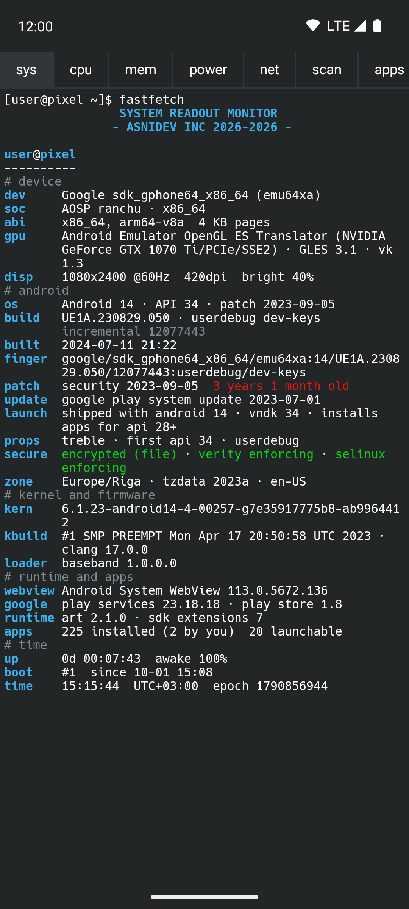
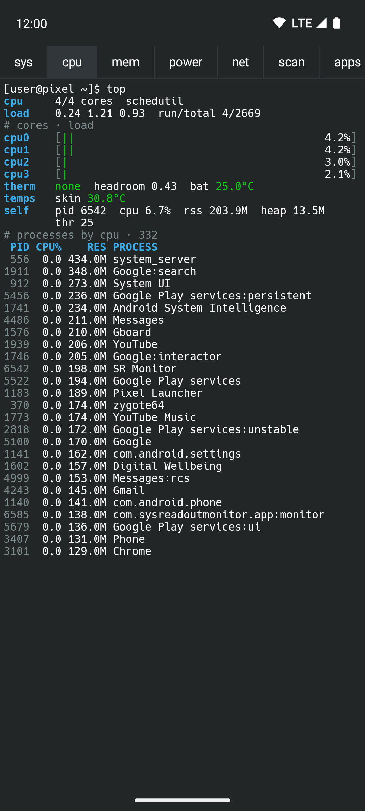
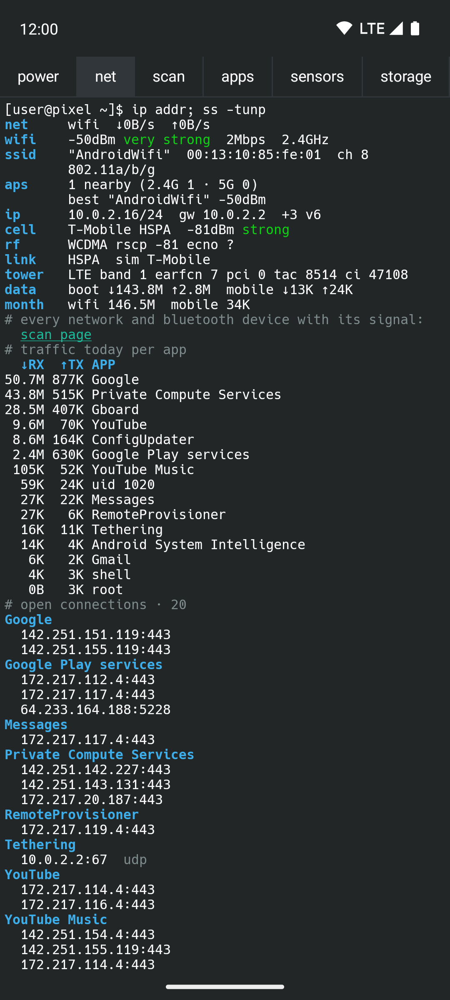
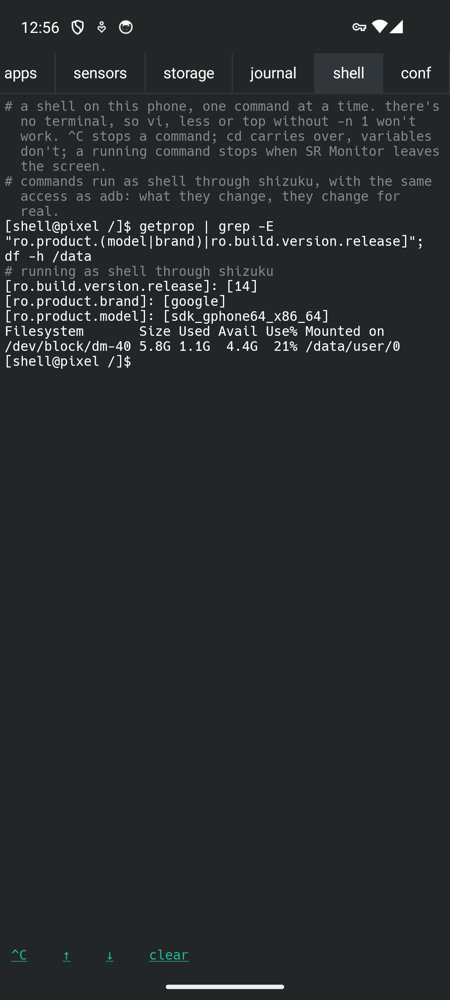

# SysReadout Monitor

**Everything your Android phone will tell you about itself, drawn as a KDE Konsole terminal.**

SysReadout Monitor (SR Monitor) groups hardware, CPU, memory, power, network, radio signals,
apps, sensors, storage, a live event journal and a shell into pages you swipe between. Each page
looks like a Konsole session on Fedora: Breeze colours, the Hack font, a bash prompt, and colour
only where it means something.

It works only while you look at it, and only for the page on screen, so it costs nothing the rest
of the time. Forked from [SysReadout Launcher](https://github.com/AndSni/SysReadout-Launcher),
which shows the same data on the home screen.

<p>




</p>

## Pages

| Tab | What it shows |
|---|---|
| `sys` | device, Android and patch level, kernel, build properties, chipset, GPU, display, uptime, app counts |
| `cpu` | per-core meters, load, thermal status, every temperature sensor, busiest processes |
| `mem` | RAM and swap meters, memory detail, processes by memory |
| `power` | battery meter, voltage, current, watts, charger, cycles, capacity; with Shizuku drain since the last charge (screen on/off, doze), time left, use by part and by app, wake locks |
| `net` | connection, Wi-Fi and mobile signal in words, IP, serving cell, 5G / LTE-CA, traffic, connections per app with server names, DNS lookups per app |
| `scan` | every Wi-Fi access point and Bluetooth device with its signal in dBm and %, how steady it is, and whether it's getting stronger; tap a device to track it and find it |
| `apps` | screen time, unlocks, notifications per app, running foreground services |
| `sensors` | environment sensors, compass, GPS and every satellite, sun and moon, steps, Bluetooth devices, audio, what's playing |
| `storage` | storage meters, file systems, biggest apps |
| `journal` | a live event log: network, power, installs, app switches, processes, connections, logcat errors, DNS lookups, notifications |
| `shell` | type commands and see their output; as the `shell` user with Shizuku |
| `conf` | all settings as a config file, and what each access is for |

Long-press any line to copy it, pinch to zoom. Everything is explained in the
**[user manual](docs/MANUAL.md)**.

## Install

- **F-Droid:** submission in preparation.
- **GitHub:** download `SysReadout-Monitor.apk` from the
  [latest release](https://github.com/AndSni/SysReadout-Monitor/releases/latest) and open it
  (allow "install unknown apps").

Requires Android 8.0 (API 26) or newer.

## Permissions

Nothing beyond the basics is used until you tap the thing that needs it, and runtime permissions
are requested at that moment.

| Permission | Used for | When |
|---|---|---|
| Network state, Wi-Fi state | connection type, IP, Wi-Fi signal | install-time, no prompt |
| Query all packages | real app names for processes, connections, traffic and app counts | install-time |
| Internet | **only** the optional DNS monitor, which relays your apps' own lookups to your DNS server | only if you switch it on |
| Usage access | screen time, traffic, app sizes, app and screen events | you grant it in Android settings |
| Notification access | notification counts and events, what's playing | you grant it in Android settings |
| Location | GPS, satellites, Wi-Fi name, networks nearby, serving cell, sunrise | asked when you tap it |
| Phone | 5G / LTE-CA link details | asked when you tap it |
| Nearby devices (Bluetooth scan) | Bluetooth signal on the scan page; never used for location | asked when you tap it |
| Bluetooth connect | connected devices, their battery, tracked device signal | asked when you tap it |
| Physical activity | steps | asked when you tap it |
| Bluetooth, Bluetooth admin (Android ≤ 11) | Bluetooth state and scanning on old Android | install-time on old Android |
| [Shizuku](https://shizuku.rikka.app/) (optional) | processes, connections, per-core load, temperatures, wake locks, battery use per app, logcat, the shell as `shell` | a guided setup in `conf › [shizuku]` |

## Privacy

No ads, no analytics, no tracking, no accounts. Everything is read on the phone and kept in memory
while the app runs; only your settings are stored. Nothing is sent anywhere: the only network use
is the optional DNS monitor passing your apps' own lookups on to your DNS server (Quad9 or
Cloudflare only if the network names none), and optional reverse-DNS lookups of connection
addresses.

## Build

Requirements: JDK 17 or 21, Android SDK (compileSdk 36).

```sh
./gradlew :app:assembleDebug :app:lintDebug :app:testDebugUnitTest
```

The Gradle root is the repository root; the app module is `app/`.

### Release signing

Release builds are signed from a `keystore.properties` file at the repository root, which is
**not** in git:

```properties
storeFile=/absolute/path/to/sysreadoutmonitor-release.jks
storePassword=…
keyAlias=sysreadoutmonitor
keyPassword=…   # PKCS12 keystores: same as storePassword
```

Without it, `assembleRelease` falls back to the debug key. CI gets the same values from repository
secrets (`RELEASE_KEYSTORE_B64`, `RELEASE_KEYSTORE_PASSWORD`, `RELEASE_KEY_ALIAS`,
`RELEASE_KEY_PASSWORD`).

### Releasing a version

1. Bump `versionCode` (+1) and `versionName` in `app/build.gradle.kts`.
2. Add `metadata/en-US/changelogs/<versionCode>.txt`.
3. Commit and push to `main`; CI publishes a rolling
   [`latest`](https://github.com/AndSni/SysReadout-Monitor/releases/tag/latest) release.
4. Put the full hash of that commit into `.fdroid.yml` (`commit:`), update `versionName`,
   `versionCode`, `CurrentVersion`, `CurrentVersionCode`, commit and push.
5. Tag the release commit `vX.Y.Z` and push the tag. `release-tag.yml` publishes a permanent
   release whose `SysReadout-Monitor.apk` is what F-Droid compares its own build against
   (`Binaries`, `AllowedAPKSigningKeys` in `.fdroid.yml`).

Signing certificate SHA-256: `3b69c2d7c54417c453b4c676f23e36119374a68e1109c323a0c251581c6005dc`

## Credits

- Forked from [SysReadout Launcher](https://github.com/AndSni/SysReadout-Launcher).
- Look: KDE Konsole's Breeze colour scheme; the [Hack](https://github.com/source-foundry/Hack)
  font 3.003 (MIT with the Bitstream Vera licence, see
  [`app/src/main/assets/licenses`](app/src/main/assets/licenses), also in the app under
  `conf › [about]`).
- [Shizuku](https://github.com/RikkaApps/Shizuku) API (Apache-2.0), AndroidX and Jetpack Compose
  (Apache-2.0), Kotlin (Apache-2.0).

## License

GPL-3.0-only, see [`LICENSE`](LICENSE).
